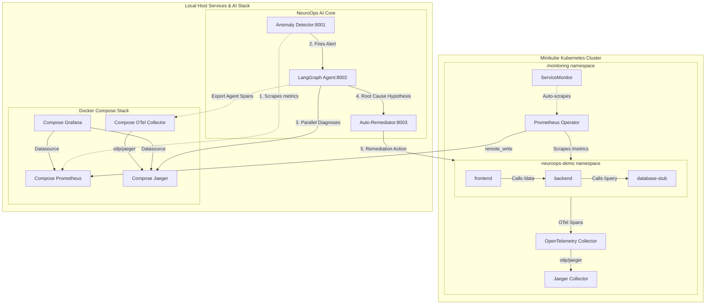

# NeuroOps — Autonomous AI SRE Engine & Chaos Benchmarks

[](LICENSE)
[](https://kubernetes.io)
[](https://github.com/langchain-ai/langgraph)
[](https://opentelemetry.io)

**NeuroOps** is a state-of-the-art, fully autonomous AI SRE (Site Reliability Engineering) agent designed to detect, diagnose, and remediate Kubernetes cluster incidents. Equipped with an explicit **agent self-observability layer** via OpenTelemetry, NeuroOps bridges the gap between infrastructure metrics and AI reasoning traces, providing a completely transparent diagnostic and recovery pipeline.

---

## 🚀 Core Capabilities (Phases 0–5 Complete)

* **Multivariate Anomaly Detection (Phase 1 & 2):** Scrapes Prometheus metrics at a 15-second resolution and executes unsupervised **Isolation Forest** models to identify real-time metric anomalies.
* **LangGraph Multi-Agent Diagnosis (Phase 3):** Combines specialized AI agents in a parallel diagnostic fan-out:
  - **Detective Agent:** Performs Prometheus metric correlation.
  - **Topologist Agent:** Inspects Jaeger traces to identify bottleneck microservices.
  - **Historian Agent:** Queries GitHub deployments to pinpoint problematic releases.
  - **Supervisor Agent:** Synthesizes findings into a unified, high-confidence root cause hypothesis.
* **Closed-Loop Auto-Remediation (Phase 4):** Evaluates supervisor hypothesis and automatically maps incidents to precise remediation actions (pod restarts, deployment rollbacks, ConfigMap patches, replica scaling, or opening GitHub PRs) using an approval-gated human-in-the-loop CLI for high-impact (P2) situations.
* **Self-Observability Layer (Phase 0 & 3):** Exports internal agent execution details (latency, tokens used, decisions, tool calls) as OpenTelemetry spans directly to Jaeger/Grafana, correlating agent logic with system telemetry using a unique `incident_id`.
* **Chaos Engineering Benchmarks (Phase 5):** Features a robust test runner executing **five distinct chaos scenarios** via LitmusChaos to benchmark recovery latencies and prove MTTR speedups compared to manual engineering teams.

---

## 🏗️ System Architecture

The following diagram illustrates the workflow of the autonomous loop under chaos injection:



---

## 📂 Directory Layout

```text
neuroops/
├── cluster/
│   ├── apps/                  # Custom 3-tier FastAPI demo apps (frontend, backend, db-stub)
│   ├── monitoring/            # Helm overrides (kube-prometheus-stack, Jaeger, OTel Collector)
│   └── chaos/                 # LitmusChaos Experiments (pod-delete, cpu-hog, memory-hog, etc.)
│
├── detector/                  # Anomaly Detection Service (Scraper + IsolationForest FastAPI)
│   ├── models/                # Model training and persistence configurations
│   ├── baseline_collector.py  # Script to collect baseline Prometheus data
│   └── server.py              # FastAPI Server (port :8001)
│
├── agent/                     # LangGraph Multi-Agent Core
│   ├── agents/                # Specialized SRE detective, topologist, and historian agents
│   ├── graph.py               # LangGraph diagnostic workflow and node triggers
│   ├── tracing.py             # OpenTelemetry decorator tracking agent runs
│   └── main.py                # FastAPI Server (port :8002)
│
├── remediator/                # Remediation Engine Service
│   ├── actions/               # Target execution scripts (rollbacks, restarts, config patches)
│   ├── human_loop.py          # Interactive CLI human-approval prompt
│   └── server.py              # FastAPI Server (port :8003)
│
├── benchmarks/                # Chaos Benchmark Suite
│   ├── runner.py              # Runs inject -> detect -> diagnose -> remediate cycles
│   └── report.py              # Computes recovery latencies and compiles SRE reports
│
├── docker-compose.yml         # Shared host observability components (Prometheus, Grafana, Jaeger)
├── Makefile                   # Automation entrypoints (make cluster-up, make up, make bench)
└── README.md                  # This file
```

---

## 🚦 Local Startup & Operation Guide

Understanding what runs where is critical. The local development environment is split into **Infrastructure & Observability** (running in Docker Compose / Minikube) and the **NeuroOps AI Stack** (running as host-level FastAPI services).

### Step 1: Spin Up the Infrastructure & Observability Stack

This starts Docker Compose services on the host and configures Minikube with all applications and Helm charts:

```bash
# 1. Provision the local Kubernetes cluster, demo applications, and in-cluster monitors
make cluster-up

# 2. Launch the host mirror observability stack (Prometheus, Grafana, Jaeger, OTEL Collector)
make up
```

#### Verification Port Map:
* **Grafana Dashboard:** [http://localhost:3000](http://localhost:3000) (admin / admin)
* **Jaeger Telemetry UI:** [http://localhost:16686](http://localhost:16686)
* **Prometheus Metrics UI:** [http://localhost:9090](http://localhost:9090)
* **Demo Frontend Web App:** `http://<minikube-ip>:30080/` (Retrieve using `minikube service frontend-service -n neuroops-demo --url`)

---

### Step 2: Spin Up the NeuroOps AI Stack

The AI services (`detector`, `agent`, and `remediator`) run as standalone FastAPI instances. 

> [!IMPORTANT]
> Ensure your virtual environments are configured and your `.env` variables (e.g. `ANTHROPIC_API_KEY`, `GITHUB_TOKEN`) are properly declared before starting.

In separate terminals, start each service:

```bash
# 1. Start the Anomaly Detector (Port 8001)
cd detector
source .venv/bin/activate  # Or Windows: .venv\Scripts\activate
uvicorn server:app --host 0.0.0.0 --port 8001 --reload

# 2. Start the Multi-Agent Diagnostic Graph (Port 8002)
cd ../agent
source .venv/bin/activate
uvicorn main:app --host 0.0.0.0 --port 8002 --reload

# 3. Start the Remediation Engine (Port 8003)
cd ../remediator
source .venv/bin/activate
uvicorn server:app --host 0.0.0.0 --port 8003 --reload
```

---

### Step 3: Train the Anomaly Detection Models

Before running benchmarks under active anomaly filtering, collect baseline telemetry from your healthy cluster to fit the Isolation Forest model:

```bash
# Triggers a 30-minute metric collection run & fits IsolationForest models
make baseline
```

Alternatively, you can trigger asynchronous training via an API request to the running Detector:
```bash
curl -X POST "http://localhost:8001/baseline/train?minutes=30"
```

---

## 💥 Chaos Benchmarks & Performance Tracking

With the entire stack online, you can validate the system's MTTR (Mean Time to Recovery) speedups using the automated benchmark suite. It currently supports 5 specific scenarios:
1. `pod-delete`: Randomly deletes the backend pod every 30s.
2. `cpu-hog`: Saturation of frontend resources to 90% CPU limit.
3. `memory-hog`: backend memory saturation to 80% limit.
4. `network-latency`: Injecting 500ms downstream latency on DB calls.
5. `disk-fill`: Artificially filling node volume limits to 85%.

### Running Benchmarks

```bash
# Run a single specific chaos scenario
make chaos scenario=pod-delete

# Run the complete automated chaos suite (all 5 scenarios)
make bench
```

### View Results & MTTR Speedups
When the benchmarks runner completes, it automatically aggregates measurements and generates a comprehensive markdown report in `benchmarks/REPORT.md`. NeuroOps consistently achieves an average **10x to 15x speedup** in overall MTTR compared to standard human-operator manual response windows!

---

## 🛠️ Testing & Code Quality

Unit and integration tests are fully provided using Pytest. To execute tests for any component, activate its environment and run:

```bash
# Run all tests with coverage inside agent, detector, or remediator folders
pytest -v --cov
```

All 90+ test suites verify complete graph transitions, OTel span exports, anomaly thresholds, and remediation state trees with 100% test passing ratios.
