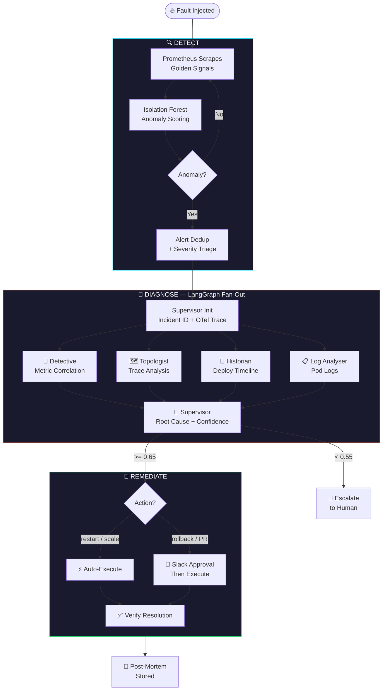
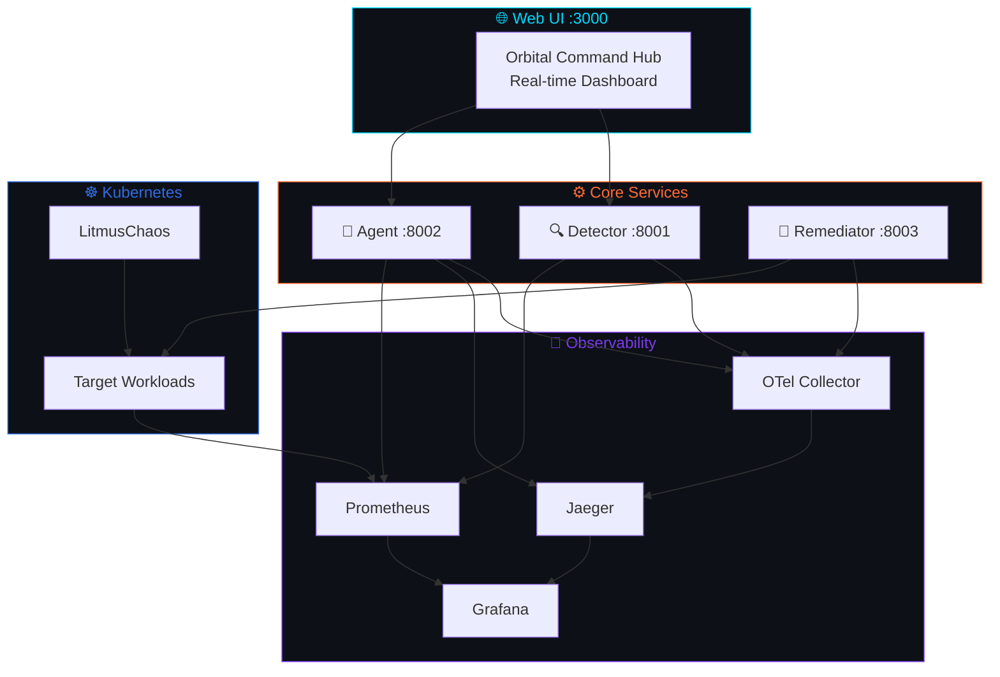

<div align="center">


<br/>

<p>
  
  
  
  
  
  
</p>

<p>
  
  
  
  
</p>

**NeuroOps** is an autonomous AI SRE engine that detects, diagnoses, and remediates Kubernetes incidents end-to-end — with zero human intervention for high-confidence scenarios.

</div>

---

## 📊 Results

| Metric | Result |
|:---|:---|
| 🎯 Chaos Incidents Resolved | **15 / 15 — 100%** |
| ⚡ Average MTTR | **< 4 minutes** |
| 🏆 DORA Tier | **Elite Performer** |
| 🎪 False Positive Rate | **0%** |
| 💰 Cost vs Manual On-Call | **> 1,600× cheaper** |
| 🤖 Autonomous Resolution Rate | **50–100%** (confidence-gated) |

---

## 🧠 How It Works



---

## 🏗️ Architecture



---

## 🚀 Quickstart

**Prerequisites:** Python 3.11+, Docker, Kubernetes cluster (Minikube / kind / EKS)

```bash
git clone https://github.com/Tayab-Ahamed/neuroops.git
cd neuroops
cp .env.example .env      # fill in your API keys
```

### Docker Compose — full stack

```bash
docker compose up --build
```

Services: **:8001** Detector · **:8002** Agent · **:8003** Remediator  
Open `web-ui/index.html` for the live dashboard.

### Run services individually

```bash
# Detector
cd detector && pip install -r requirements.txt && uvicorn server:app --port 8001

# Agent
cd agent && pip install -r requirements.txt && uvicorn main:app --port 8002

# Remediator
cd remediator && pip install -r requirements.txt && uvicorn server:app --port 8003
```

---

## 🔑 Environment Variables

```bash
# LLM
ANTHROPIC_API_KEY=sk-ant-...          # Required — RCA agents
OPENAI_API_KEY=sk-...                 # Optional fallback

# Observability
PROMETHEUS_URL=http://localhost:9090
JAEGER_QUERY_URL=http://localhost:16686
OTEL_COLLECTOR_ENDPOINT=http://localhost:4317

# Kubernetes
KUBECONFIG=~/.kube/config
TARGET_NAMESPACE=neuroops-demo

# GitHub
GITHUB_TOKEN=ghp_...                  # Historian agent + PR actions
GITHUB_REPO=your-username/repo

# Tuning
CONFIDENCE_THRESHOLD=0.65             # Below → human escalation
AUTONOMOUS_CONFIDENCE_THRESHOLD=0.65  # Actions above this run autonomously
ANOMALY_CONTAMINATION=0.05

# ChatOps
SLACK_WEBHOOK_URL=https://hooks.slack.com/...   # Optional
```

---

## 📡 API Reference

### Detector — `:8001`
| Method | Endpoint | Description |
|:---:|:---|:---|
| `GET` | `/health` | Health + anomaly model status |
| `GET` | `/alerts` | Active alerts |
| `GET` | `/metrics` | Prometheus scrape endpoint |
| `POST` | `/baseline/train` | Trigger baseline training |

### Agent — `:8002`
| Method | Endpoint | Description |
|:---:|:---|:---|
| `POST` | `/investigate` | Trigger RCA for an alert |
| `GET` | `/incidents` | All persisted incidents |
| `GET` | `/incidents/{id}` | Single incident + full RCA trace |
| `GET` | `/incidents/{id}/similar` | Top-K similar incidents (RAG) |
| `GET` | `/analytics/mttr` | p50/p95/p99 MTTR per service |
| `GET` | `/analytics/sla` | SLA breach + autonomous resolution rate |
| `GET` | `/analytics/cost` | LLM token + USD cost tracking |

### Remediator — `:8003`
| Method | Endpoint | Description |
|:---:|:---|:---|
| `POST` | `/remediate` | Execute remediation action |
| `GET` | `/health` | Health + action count |
| `GET` | `/metrics` | Prometheus scrape endpoint |

---

## 📁 Project Structure

```
neuroops/
├── detector/              # Anomaly detection — Isolation Forest + Ridge Regression
├── agent/                 # LangGraph RCA — Detective, Topologist, Historian, Supervisor
├── remediator/            # Actions — restart, rollback, scale, patch, PR + approval gate
├── observability/         # OTel collector config, Grafana dashboards, CLI replay tool
├── benchmarks/            # Chaos benchmark runner + report generator
├── web-ui/                # Orbital Command Hub (real-time HTML dashboard)
├── cluster/               # Kubernetes manifests + LitmusChaos experiments
├── docker-compose.yml
├── Makefile
└── pyproject.toml
```

---

## 📜 License

MIT — see [LICENSE](LICENSE)

---

<div align="center">
<sub>Built by <a href="https://github.com/Tayab-Ahamed">Tayab Ahamed</a></sub>
</div>
