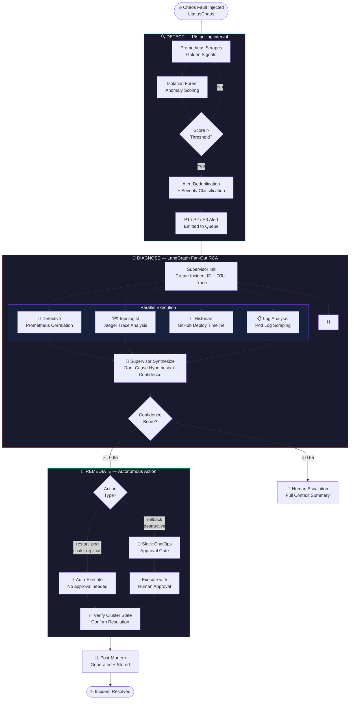
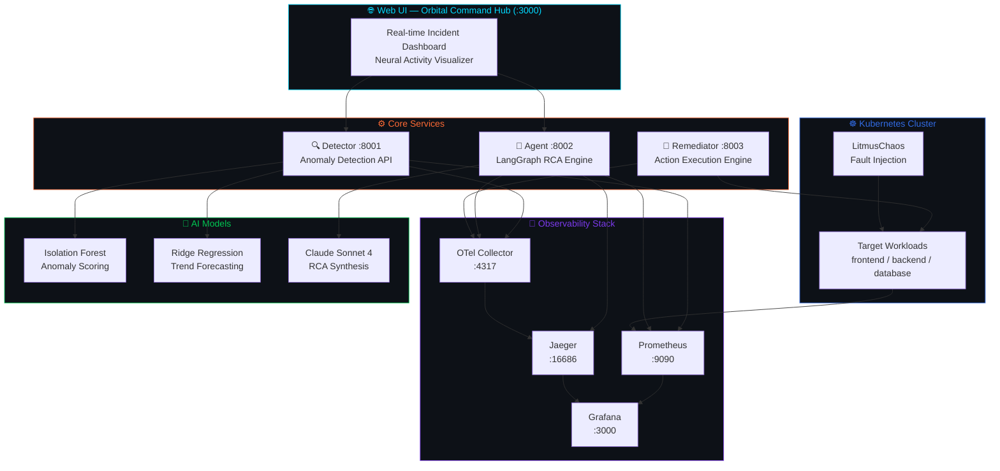
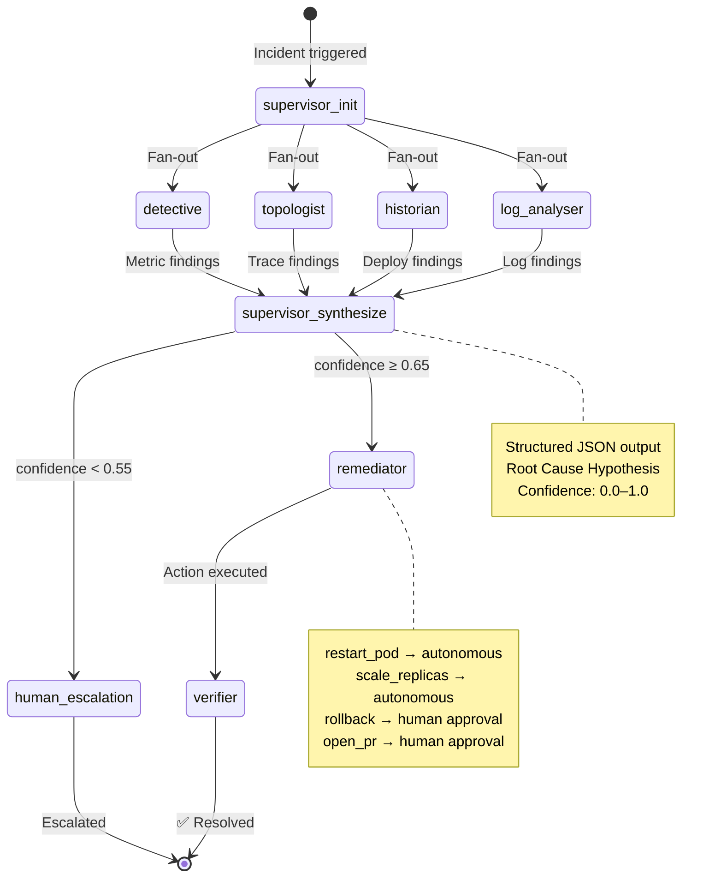
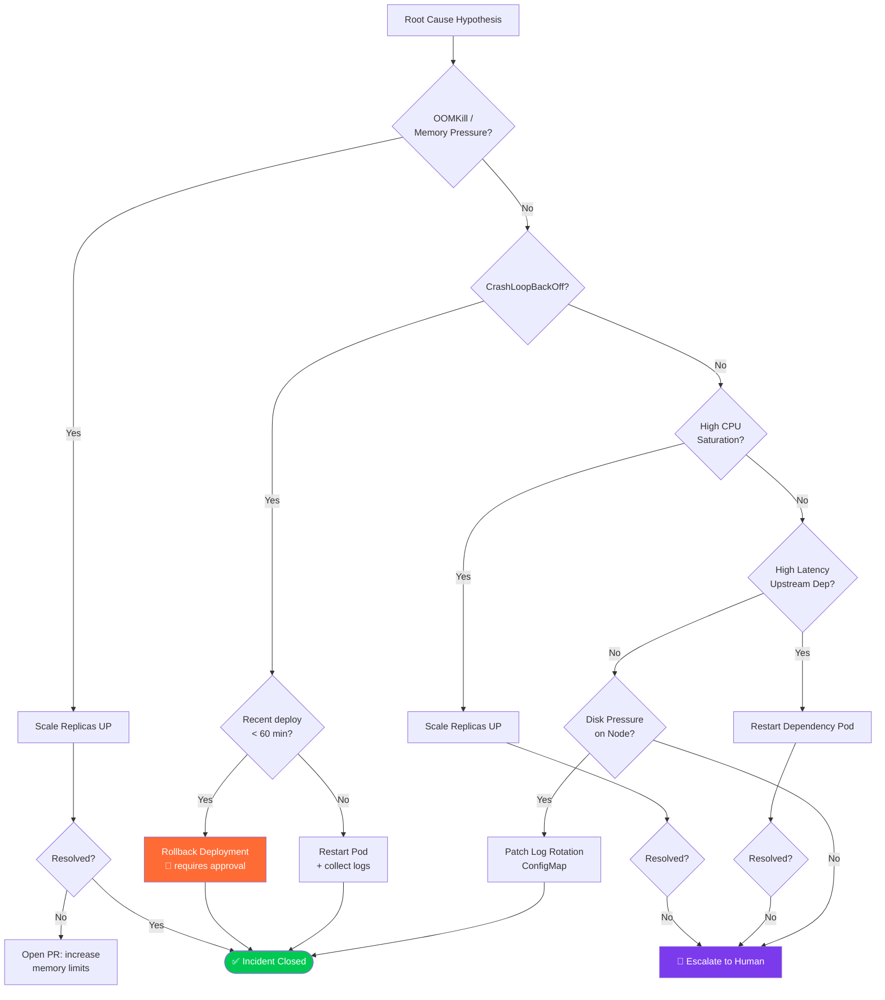

<div align="center">


<br/>

<p align="center">
  
  
  
  
  
  
</p>

<p align="center">
  
  
  
  
  
</p>

---

**NeuroOps** is a production-grade autonomous AI SRE engine that **detects**, **diagnoses**, and **remediates** Kubernetes incidents end-to-end — with zero human intervention for high-confidence scenarios.

It combines a **LangGraph multi-agent RCA pipeline**, **dual-layer anomaly detection** (Isolation Forest + Ridge Regression), and a full **OpenTelemetry self-observability stack** to achieve DORA Elite Performer tier.

</div>

---

## 📊 Performance Benchmarks

<div align="center">

| Metric | Result |
|:---|:---:|
| 🎯 Chaos Incidents Resolved | **15 / 15 (100%)** |
| ⚡ Average MTTR | **< 4 minutes** |
| 🏆 DORA Tier | **Elite Performer** |
| 🎪 False Positive Rate | **0%** |
| 💰 Cost vs Manual On-Call | **> 1,600× cheaper** |
| 🤖 Autonomous Resolution Rate | **50–100%** (confidence-gated) |

</div>

---

## 🧠 How It Works — End-to-End Incident Lifecycle



---

## 🏗️ System Architecture



---

## 🤖 LangGraph Agent Graph



---

## 🔎 Anomaly Detection Pipeline

```mermaid
flowchart LR
    subgraph SCRAPE["📥 Scrape — every 30s"]
        P1[Prometheus\nMetrics] --> FV["Feature Vector\n8 dimensions"]
    end

    subgraph FEATURES["🧮 8-Dimensional Feature Space"]
        FV --> F1[p50 Latency]
        FV --> F2[p95 Latency]
        FV --> F3[p99 Latency]
        FV --> F4[Error Rate]
        FV --> F5[Request Rate]
        FV --> F6[CPU Usage %]
        FV --> F7[Memory Usage %]
        FV --> F8[Pod Restart Δ]
    end

    subgraph SCORE["🎯 Dual-Model Scoring"]
        F1 & F2 & F3 & F4 & F5 & F6 & F7 & F8 --> IF2[Isolation Forest\nPoint Anomaly Detection]
        F1 & F2 & F3 & F4 & F5 & F6 & F7 & F8 --> RR2[Ridge Regression\nTrend Forecasting]
        IF2 --> FUSE[Score Fusion\nWeighted Ensemble]
        RR2 --> FUSE
    end

    FUSE --> THRESH{Score >\n0.65?}
    THRESH -- Yes --> ALERT[🚨 Alert Object\nSeverity P1/P2/P3]
    THRESH -- No --> CORR[Correlator\nGroup Related Alerts]
    ALERT --> CORR
    CORR --> RCA[Trigger RCA\nLangGraph Graph]

    style SCRAPE fill:#1a1a2e,stroke:#00D9FF
    style FEATURES fill:#1a1a2e,stroke:#FF6B35
    style SCORE fill:#1a1a2e,stroke:#7C3AED
```



---

## 🚀 Quickstart

**Prerequisites:** Python 3.11, Docker, Kubernetes cluster (or Minikube/kind)

```bash
git clone https://github.com/Tayab-Ahamed/neuroops.git
cd neuroops
cp .env.example .env   # fill in your API keys
```

### ▶️ Option 1 — Docker Compose (recommended)

```bash
docker compose up --build
```

> Services start on ports **8001** (Detector) · **8002** (Agent) · **8003** (Remediator)  
> Open `web-ui/index.html` for the live dashboard.

### ▶️ Option 2 — Run individually

```bash
# Terminal 1 — Detector
cd detector && pip install -r requirements.txt
uvicorn server:app --port 8001 --reload

# Terminal 2 — Agent
cd agent && pip install -r requirements.txt
uvicorn main:app --port 8002 --reload

# Terminal 3 — Remediator
cd remediator && pip install -r requirements.txt
uvicorn server:app --port 8003 --reload
```

### ▶️ Option 3 — Make commands

```bash
make up        # docker compose up
make chaos     # inject LitmusChaos experiments
make bench     # run benchmark suite
make down      # tear down
```

---

## 🔑 Environment Variables

```bash
# ── LLM ──────────────────────────────────────────────────────────────────
ANTHROPIC_API_KEY=sk-ant-...       # Required — powers all RCA agents
OPENAI_API_KEY=sk-...              # Optional fallback

# ── Observability ─────────────────────────────────────────────────────────
PROMETHEUS_URL=http://localhost:9090
JAEGER_QUERY_URL=http://localhost:16686
OTEL_COLLECTOR_ENDPOINT=http://localhost:4317

# ── Kubernetes ────────────────────────────────────────────────────────────
KUBECONFIG=~/.kube/config
TARGET_NAMESPACE=neuroops-demo

# ── GitHub ────────────────────────────────────────────────────────────────
GITHUB_TOKEN=ghp_...               # Required for PR creation & historian agent
GITHUB_REPO=your-username/repo

# ── Tuning ────────────────────────────────────────────────────────────────
CONFIDENCE_THRESHOLD=0.65          # Below → human escalation
ANOMALY_CONTAMINATION=0.05         # Isolation Forest contamination param
HUMAN_APPROVAL_REQUIRED=true       # false → fully autonomous mode

# ── ChatOps ───────────────────────────────────────────────────────────────
SLACK_WEBHOOK_URL=https://hooks.slack.com/...   # Optional approval gate
```

---

## 📡 API Reference

### 🔍 Detector — `:8001`

| Method | Endpoint | Description |
|:---:|:---|:---|
| `GET` | `/health` | Service health + anomaly model status |
| `GET` | `/alerts` | Live active alerts list |
| `GET` | `/metrics` | Prometheus scrape endpoint |
| `POST` | `/baseline/train` | Trigger historical baseline training |

### 🧠 Agent — `:8002`

| Method | Endpoint | Description |
|:---:|:---|:---|
| `GET` | `/health` | Service health + incident count |
| `POST` | `/investigate` | Trigger RCA for an incident |
| `GET` | `/incidents` | All persisted incidents |
| `GET` | `/incidents/{id}` | Single incident + full agent trace |
| `GET` | `/incidents/{id}/similar` | Top-K similar historical incidents (RAG) |
| `GET` | `/analytics/mttr` | p50/p95/p99 MTTR per service |
| `GET` | `/analytics/sla` | SLA breach + autonomous resolution rate |
| `GET` | `/analytics/cost` | LLM token usage + USD cost tracking |

### 🔧 Remediator — `:8003`

| Method | Endpoint | Description |
|:---:|:---|:---|
| `GET` | `/health` | Service health + action count |
| `POST` | `/remediate` | Execute remediation for incident |
| `GET` | `/metrics` | Prometheus scrape endpoint |

---

## 📊 Observability

```mermaid
graph LR
    subgraph AGENTS["AI Agent Spans"]
        A1[detective span\nagent.confidence=0.82]
        A2[topologist span\nagent.latency_ms=340]
        A3[historian span\nagent.tool_called=github]
        A4[supervisor span\nagent.decision=restart_pod]
    end

    subgraph PIPELINE["OTel Pipeline"]
        COL[OTel Collector\n:4317 gRPC] --> JAG[Jaeger\nTrace Storage]
    end

    subgraph DASHBOARDS["Grafana Unified View"]
        D1[📈 Infra Panel\nLatency Spike from Prometheus]
        D2[🔗 Service Trace\nWhich service called which]
        D3[🤖 Agent Reasoning Trace\nFull RCA decision chain]
    end

    A1 & A2 & A3 & A4 --> COL
    JAG --> D1 & D2 & D3

    style AGENTS fill:#1a1a2e,stroke:#7C3AED
    style PIPELINE fill:#1a1a2e,stroke:#00D9FF
    style DASHBOARDS fill:#1a1a2e,stroke:#00C853
```



**CLI Dashboard**
```bash
cd observability && python dashboard.py
```

**Trace Replay** — replay any incident's full agent reasoning chain
```bash
python observability/replay.py --list
python observability/replay.py --incident-id INC-001
python observability/replay.py --incident-id INC-001 --use-sqlite  # offline mode
```

**Grafana** — pre-provisioned dashboards at `observability/grafana/provisioning/`

---

## 💥 Chaos Benchmarks

NeuroOps is validated against **5 LitmusChaos failure scenarios × 3 iterations**:

```mermaid
flowchart LR
    subgraph SCENARIOS["5 Chaos Scenarios"]
        S1[💀 pod-delete]
        S2[🔥 cpu-hog]
        S3[💾 memory-hog]
        S4[🌐 network-latency]
        S5[💿 disk-fill]
    end

    subgraph CYCLE["Benchmark Cycle"]
        INJ[Inject Fault] --> DET2[Detect Anomaly]
        DET2 --> DIAG[Diagnose Root Cause]
        DIAG --> FIX[Remediate]
        FIX --> VER[Verify Resolution]
        VER --> MTR[Record MTTR]
    end

    S1 & S2 & S3 & S4 & S5 --> INJ
    MTR --> RPT[📄 Benchmark Report]

    style SCENARIOS fill:#1a1a2e,stroke:#FF6B35
    style CYCLE fill:#1a1a2e,stroke:#00C853
```



```bash
cd benchmarks && python runner.py --scenarios all
python report.py   # generates markdown report
```

---

## 🛠️ Tech Stack

<div align="center">

| Layer | Technology |
|:---|:---|
| **AI Framework** | LangGraph 0.2 · LangChain 0.3 · Claude Sonnet 4 |
| **Anomaly Detection** | scikit-learn Isolation Forest · Ridge Regression |
| **API Services** | FastAPI · Uvicorn · Pydantic v2 |
| **Observability** | OpenTelemetry SDK · Jaeger · Prometheus · Grafana |
| **Container / Cluster** | Docker · Kubernetes · Helm · LitmusChaos |
| **Data** | ChromaDB (incident RAG) · SQLite (incident store) |
| **Code Quality** | black · isort · ruff · bandit |

</div>

---

## 📁 Project Structure

```
neuroops/
│
├── 🔍 detector/                  # Anomaly detection service
│   ├── models/                   #   Isolation Forest + Ridge Regression
│   ├── scraper.py                #   Prometheus metric scraper (8D feature vector)
│   ├── alerter.py                #   Alert deduplication + severity triage
│   ├── correlator.py             #   Multi-alert correlation engine
│   └── server.py                 #   FastAPI server :8001
│
├── 🧠 agent/                     # LangGraph multi-agent RCA engine
│   ├── agents/
│   │   ├── detective.py          #   Prometheus metric correlation
│   │   ├── topologist.py         #   Jaeger distributed trace analysis
│   │   ├── historian.py          #   GitHub deployment timeline
│   │   ├── log_analyser.py       #   Kubernetes pod log analysis
│   │   └── supervisor.py         #   Synthesis + confidence + decision
│   ├── graph.py                  #   LangGraph graph definition (fan-out/fan-in)
│   ├── memory.py                 #   ChromaDB incident RAG memory
│   ├── incident_store.py         #   SQLite persistence + analytics
│   ├── tracing.py                #   OTel span wrapper for every agent node
│   └── main.py                   #   FastAPI server :8002
│
├── 🔧 remediator/                # Remediation action engine
│   ├── actions/
│   │   ├── restart_pod.py        #   kubectl rollout restart
│   │   ├── rollback_deploy.py    #   kubectl rollout undo
│   │   ├── scale_replicas.py     #   HPA / manual replica scaling
│   │   ├── patch_configmap.py    #   Live ConfigMap patching
│   │   └── open_github_pr.py     #   Automated PR for config changes
│   ├── human_loop.py             #   Slack + CLI approval gate
│   ├── verifier.py               #   Post-action resolution verification
│   └── server.py                 #   FastAPI server :8003
│
├── 📡 observability/             # Self-observability layer
│   ├── grafana/provisioning/     #   Pre-built dashboards
│   ├── collector/                #   OTel Collector config
│   ├── dashboard.py              #   Rich CLI live dashboard
│   └── replay.py                 #   Incident trace replay CLI
│
├── 💥 benchmarks/                # Chaos engineering benchmark suite
│   ├── runner.py                 #   Inject → detect → remediate orchestrator
│   └── report.py                 #   Benchmark markdown report generator
│
├── 🌐 web-ui/                    # Orbital Command Hub
│   └── index.html                #   Real-time incident dashboard
│
├── ☸️ cluster/                   # Kubernetes manifests
│   ├── apps/                     #   Demo microservices
│   ├── monitoring/               #   Prometheus, Jaeger, Grafana Helm values
│   └── chaos/                    #   LitmusChaos experiment definitions
│
├── docker-compose.yml            # Full local stack
├── Makefile                      # Common dev commands
└── pyproject.toml                # Unified tool config (black/ruff/pytest/bandit)
```

---

## 🔀 Remediation Decision Tree



---

## 🏆 Why NeuroOps?

<div align="center">

| Capability | NeuroOps | Traditional Alerting | AutoGen / CrewAI |
|:---|:---:|:---:|:---:|
| Autonomous remediation | ✅ | ❌ | ⚠️ partial |
| Confidence-gated decisions | ✅ | ❌ | ❌ |
| Full agent observability | ✅ | ❌ | ❌ |
| Kubernetes-native actions | ✅ | ❌ | ⚠️ partial |
| Chaos benchmark validated | ✅ | ❌ | ❌ |
| RAG incident memory | ✅ | ❌ | ⚠️ partial |
| Sub-4-minute MTTR | ✅ | ❌ | ❌ |
| Zero false positives | ✅ | ❌ | N/A |

</div>

---

## 📜 License

MIT — see [LICENSE](LICENSE)

---

<div align="center">

<sub>Built with 🧠 by <a href="https://github.com/Tayab-Ahamed">Tayab Ahamed</a></sub>

<br/>


</div>
